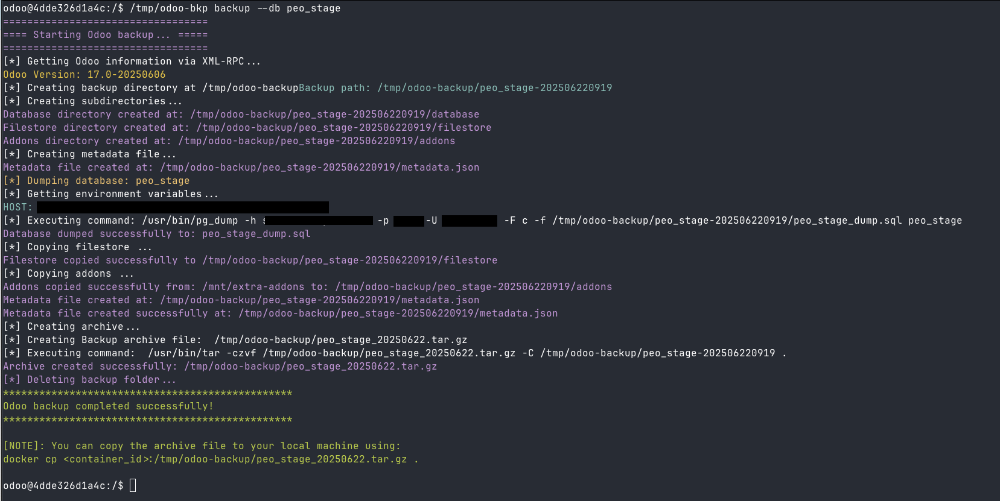

# Odoo Backup and Recovery Tool

This tool allows you to backup your Odoo container, including the database, filestore, and addons.

## Backup Command

The `backup` command creates a tar.gz archive of your Odoo container.

### Usage

```
odoo-bkp backup --db <database_name>
```

### Flags

*   `--db`: (Required) The name of the Odoo database to backup.
*   `--backup-dir`: (Optional) The directory to store the backup archive. Defaults to `/tmp/odoo-backup/`.
*   `--addons-dir`: (Optional) The directory containing the Odoo addons. Defaults to `/mnt/extra-addons`.
*   `--rm-backup-dir`: (Optional) Delete backup folder after create archive. Defaults to `true`.


## Environment Variables

The following environment variables must be set (they are by default inside the container) for the backup and recover commands to work:

*   `HOST`: The hostname of the PostgreSQL server.
*   `PORT`: The port number of the PostgreSQL server.
*   `USER`: The username to connect to the PostgreSQL server.
*   `PASSWORD`: The password to connect to the PostgreSQL server.

## Example

To backup the database `my_odoo_db`:

```
odoo-bkp backup --db my_odoo_db
```

## Running the tool inside the Odoo container

1.  Copy the compiled binary to the Odoo container:

```bash
docker cp odoo-bkp <container_name>:/opt/odoo-bkp
```

2.  Connect to the Odoo container:

```bash
docker exec -it <container_name> bash
```

3.  Make the binary executable:

```bash
chmod +x /opt/odoo-bkp
```

4.  Run the tool:

```bash
/opt/odoo-bkp <command> <flags>
```

Replace `<container_name>` with the name of your Odoo container.


### Screenshot

